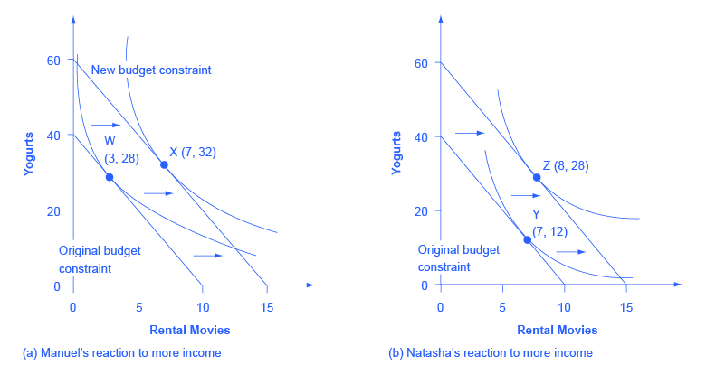

<!--html_preserve-->
<a href="https://github.com/btbeal" class="github-corner" aria-label="View source on GitHub"><svg width="80" height="80" viewBox="0 0 250 250" style="fill:#4b2e83; color:#fff; position: absolute; top: 0; border: 0; right: 0;" aria-hidden="true"><path d="M0,0 L115,115 L130,115 L142,142 L250,250 L250,0 Z"></path><path d="M128.3,109.0 C113.8,99.7 119.0,89.6 119.0,89.6 C122.0,82.7 120.5,78.6 120.5,78.6 C119.2,72.0 123.4,76.3 123.4,76.3 C127.3,80.9 125.5,87.3 125.5,87.3 C122.9,97.6 130.6,101.9 134.4,103.2" fill="currentColor" style="transform-origin: 130px 106px;" class="octo-arm"></path><path d="M115.0,115.0 C114.9,115.1 118.7,116.5 119.8,115.4 L133.7,101.6 C136.9,99.2 139.9,98.4 142.2,98.6 C133.8,88.0 127.5,74.4 143.8,58.0 C148.5,53.4 154.0,51.2 159.7,51.0 C160.3,49.4 163.2,43.6 171.4,40.1 C171.4,40.1 176.1,42.5 178.8,56.2 C183.1,58.6 187.2,61.8 190.9,65.4 C194.5,69.0 197.7,73.2 200.1,77.6 C213.8,80.2 216.3,84.9 216.3,84.9 C212.7,93.1 206.9,96.0 205.4,96.6 C205.1,102.4 203.0,107.8 198.3,112.5 C181.9,128.9 168.3,122.5 157.7,114.1 C157.9,116.9 156.7,120.9 152.7,124.9 L141.0,136.5 C139.8,137.7 141.6,141.9 141.8,141.8 Z" fill="currentColor" class="octo-body"></path></svg></a><style>.github-corner:hover .octo-arm{animation:octocat-wave 560ms ease-in-out}@keyframes octocat-wave{0%,100%{transform:rotate(0)}20%,60%{transform:rotate(-25deg)}40%,80%{transform:rotate(10deg)}}@media (max-width:500px){.github-corner:hover .octo-arm{animation:none}.github-corner .octo-arm{animation:octocat-wave 560ms ease-in-out}}</style>
<!--/html_preserve-->

```{r setup, message = FALSE, warning=FALSE}
knitr::opts_chunk$set(echo = TRUE)
library(knitr)
library(plotly)
library(shiny)
library(tidyverse)
library(ggthemes)

# ------------------------ Creating a utility matrix for later plotting

a <- 0.6          # -- Cobb-Douglas Utility Function (a is a random choice by me)
utility <- function(x, y){ # --- will use this function to create utility values from a 100x100 matrix
  (x^a)*(y^(1-a))
}
goods_matrix <- matrix(0, # creating matrix to loop utility function over
                       nrow = 200,
                       ncol = 200)


for(r in 1:nrow(goods_matrix)){   # populating matrix with utility function
  for(c in 1:ncol(goods_matrix)){
    goods_matrix[r,c] <- utility(r,c)
    
  }
}

# ----- a budget matrix for plotting 
# budget function: 2x + 3y = z
budget <- function(x,y){
  z <- (1/4)*x + (1/2)*y
  z
}


budget_matrix <- matrix(0,
                      nrow = 200,
                      ncol = 200)

for(r in 1:nrow(budget_matrix)){
  for(c in 1:ncol(budget_matrix)){
    x <- r
    y <- c
    budget_matrix[r,c] <-  budget(x,y)
  }
}

budget_plot <- function(budget_input){
  # the budget function will be defined as z(x,y) = (1/4)x + (1/2)y
  # where budget_input = z
  x_intercept <- floor(budget_input/0.25)    # solve for maximum x coordinate (0,x)
  if(x_intercept > 200){
    x_intercept <- 200
  }
  y <- c()
  for(i in 1:x_intercept){                # iterate through all x up to x_intercept
    y_coord <- (budget_input - 0.25*i)/0.5
    if(y_coord > 200){
      y <- NA
    }
    y <- c(y, y_coord)
  }
  
  data <- data.frame(
    x = 1:x_intercept,
    y = y,
    z = rep(budget_input, x_intercept)
  )
 return(data)
}


```
<br>

## Impetus For The Post

When I first learned about utility functions and their associated indifference curves, I was shown an intimidating figure that looked a bit like the image below. If you were lucky, you were shown a computer generated image. The less fortunate had a professor furiously scribbling them onto a board.
<br>
<br>

```{r, echo=FALSE, out.width="75%", out.height="75%", fig.align = "center", fig.cap="https://opentextbc.ca/principlesofeconomics/back-matter/appendix-b-indifference-curves/"}

```


A few things were immediately of concern: why are there multiple indifference curves for one function if it only represesnts one consumer? Why are the curves moving? And... who is Natasha? So, while answering my own questions, I thought sharing the knowledge would be helpful. This post will hopefully provide a better description than maybe most of us have heard and by the end you will understand:

1. What indifference curves are and what they represent

2. How a budget constraint relates to these indifference curves and the overall utility function

3. How to optimize utility within these constraints (if you're brave)

For the scope of this post, I'll asssume you have some fundamental understanding of utility theory. 

## Utility and Indifference Curves 

Simply stated, a utility function is a function that explains the amount of utility a consumer posesses given their consumption of two different goods, $x$, and $y$. An indifference curve is just an infinitesimal slice of that function which describes all the different combinations between two goods that yields the same amount of utility (i.e. to which a person would be indifferent). So, an indifference function defined by $U(x,y) = 2x + y$ would mean that a person would be have an indifference to two "$x$'s" or one "$y$" and all the different possibilities along that curve.
<br>

In healthcare, we commonly suggest that a person's utility can be defined as their consumption of healthcare, $H$, and their consumption of all other goods, $C$, so that $U(H,C) = 2H + C$. Again, $2H + C$ is arbitrary - utility is defined by one's preferences. In this case, we would read that one prefers consumption of health half as much as consumption elsewhere. In reality, both of those variables could represent individual functions themseleves but for now we will keep it simple.
<br>

Indifference curves of a given function in two dimensions could look something like this:
<br>

```{r, fig.height=3.5, fig.width=5, fig.align="center", warning=FALSE}
utility_plot <- function(utility_input){
  # the utility function will be defined as z(x,y) = (x^0.6)(y^0.4)
  # where budget_input = z
  
  y <- c()
  for(i in 1:100){                # iterate through all x up to 100
    y_coord <- (utility_input/(i^(0.6)))^(10/4)
    y <- c(y, y_coord)
  }
  
  data <- data.frame(
    x = 1:100,
    y = y,
    z = rep(utility_input, 100)
  )
  return(data)
}

utility_list <- lapply(seq(from = 10, to = 60, by = 10), utility_plot)


full_df <- do.call(rbind, utility_list)

ggplot() +
  geom_point(data = full_df, aes(x = x, y = y, color = z)) +
  geom_path(data = full_df, aes(x = x, y = y, color = z)) +
  theme_minimal() +
  ylim(0,100) +
  labs(x = "Health", y = "Other Consumption") +
  scale_color_continuous(name = "Utility")
```
<br>

A few things to point out here before moving on. 
<br>

1. As the utility increases, the curvess shift right, and left as utility decreases.

2. Notice that the curves slope downwards - this must necessarily be the case; as one increases their consumption of $H$, they will give up the other good that they were indifferent to, $C$.

3. Everything below the curve of a given utility represents bundles that do not maximize utility. Utility theory assumes that a consume will always seek to maximize utility.

4. Understand that the slope is non-linear. In general, the more one has of something, the less utility they will gain from another unit and conversely, the more they would give up to acquire the other good. This slope has an official name: Marginal Rate of Substitution or $MRS$. We will come back to that later.  
<br>

But those are just a few slices that I have already noted as infinitesimally small.
<br>

A true utility function (comprised of an infinite amount of indifference curves), actually looks something like this (this equation is known as the Cobb-Douglas function and it was originally created to describe production):
$$U(H,C) = AH^{a}C^{1-a} $$
<br>


```{r, fig.height = 6, fig.width=5}
font_list <- list(
       family = "Helvetica, sans-serif",
       size = 10,
       color = "#4b2e83"
     )
     
     x_axis <- list(
       title = "Health Consumption",
       titlefont  = font_list
     )
     
     y_axis <- list(
       title = "Other Consumption",
       titlefont  = font_list
     )
     
     z_axis <- list(
       title = "Utility",
       titlefont = font_list
     )
     
    p <- plot_ly() %>% 
       add_surface(z = ~goods_matrix, showscale = FALSE,
                   contours = list(
                     z = list(
                       show=TRUE,
                       usecolormap=TRUE,
                       highlightcolor="#ff0000",
                       project=list(z=TRUE)
                     ),
                     size = 90
                   )) %>%
       layout(
         showlegend = FALSE,
         scene = list(
           camera=list(
             eye = list(x=1.87, y=0.88, z=1)
           ),
           xaxis = x_axis,
           yaxis = y_axis,
           zaxis = z_axis
         )
       ) %>% 
      config(displayModeBar = FALSE)
      
    
    div(p, align = "center")
```

<br>
<br>

Manipulate the graphs and take a look around. Here we can see that all of those two dimensional lines are really just <span style="color:#4b2e83">**projections of a much larger 3-dimensional utility function**</span>. And the true indifference curve is only limited by the amount of utility they can purchase.
<br>

And speaking of the amount of utility one can purchase... let's talk about budget constraints.

## Budget Constraints

As I said earlier, utility theory suggests that one will seek to maximize their utility in all situations. So, naturally, their must be some constraint else a consumer would consume indefinitely, which we know is not reality. And so it isn't hard to imagine that the consumer's constraint is often a set budget - a finite amount of money they have to spend. A budget, then, tells us how much we can spend and therefore we must <span style="color:#4b2e83">**maximize our utility within that constraint**</span>. 
<br>

Let us use $z$ again to denote our budget and assume that Healthcare is half the price of all other consumption (again, an arbitrary equation). In this case, the price of one unit of Healthcare, $P_H$, is \$0.25 and the price of one unit of other consumption, $P_C$, is \$0.50. Your budget is then defined as $$I \leq (1/4)H + (1/2)C$$.

The coefficients of a budget function represent prices and could be anything in theory. In this case, I can afford 2 units of cheese to one unit of wine and my budget constraint, $I$, will tell me how much of each I can buy. Additionally, the ratio of prices, $P_C/P_H$, represents the slope of the budget function.
<br>

Again, in two-dimensions, the budget function could look something like this:

```{r, fig.height=3.5, fig.width=5, fig.align="center", warning=FALSE}

budget_plot <- function(budget_input){
  # the budget function will be defined as z(x,y) = (1/4)x + (1/2)y
  # where budget_input = z
  x_intercept <- floor(budget_input/0.25)    # solve for maximum x coordinate (0,x)
  if(x_intercept > 200){
    x_intercept <- 200
  }
  y <- c()
  for(i in 1:x_intercept){                # iterate through all x up to x_intercept
    y_coord <- (budget_input - 0.25*i)/0.5
    if(y_coord > 200){
      y <- NA
    }
    y <- c(y, y_coord)
  }
  
  data <- data.frame(
    x = 1:x_intercept,
    y = y,
    z = rep(budget_input, x_intercept)
  )
  return(data)
}

budget_list <- lapply(seq(from = 10, to = 60, by = 10), budget_plot)


full_df <- do.call(rbind, budget_list)

ggplot() +
  geom_point(data = full_df, aes(x = x, y = y, color = z)) +
  theme_minimal() +
  ylim(0,100) +
  scale_color_continuous(name = "Budget") +
  labs(x = "Healthcare", y = "Other Consumption")
```


Again, as the budget (or income) increases, the combination of goods one can purchase increases. And, anything below that maximal segment would be considered inferior as a consumer seeks to maximize their goods purchased with income. In reality, the budget function, similar to a utility function, looks something like this (depending on the ratio of prices for two goods):

```{r}

# --------- Creating Plot_ly
font_list <- list(
  family = "Helvetica, sans-serif",
  size = 10,
  color = "#4b2e83"
)

x_axis <- list(
  title = "Health",
  titlefont  = font_list
)

y_axis <- list(
  title = "Other",
  titlefont  = font_list
)

z_axis <- list(
  title = "Budget",
  titlefont = font_list
)

b_plot <- plot_ly() %>% 
  add_surface(z = ~budget_matrix, showscale = FALSE,
              contours = list(
                z = list(
                  show=TRUE,
                  usecolormap=TRUE,
                  highlightcolor="#ff0000",
                  project=list(z=TRUE)
                ),
                size = 90
              )) %>%
  layout(
    scene = list(
      camera=list(
        eye = list(x=1.87, y=0.88, z=1)
      ),
      xaxis = x_axis,
      yaxis = y_axis,
      zaxis = z_axis
    )
  )

div(b_plot, align = "center")
```

As your budget increases, $z$, so does your ability to purchase larger combinations of goods, $H$ and $C$. But a consumer is limited to the budget she has. And, similar to the consumers utility: we assume that a consumer maximizes their budget (so that $I = (1/4)H + (1/2)C$) and that everything below the curve is considered suboptimal. As a persons budget increases, the line shifts right, and left as a budget decreases.
<br>

So now the question remains, how to maximize utility within a given budget constraint if we know the functions that define both?

## Maximizing the Utility Function

### Marginal Rate of Substitution = Ratio of Prices
The first, and simplest method, is to find the point where the budget constraint, $budget = (1/4)H + (1/2)C$, and the utility function, $U(H,C) = AH^{a}C^{1-a}$, are tangent. In other words, the point on both graphs where the slopes are equal.
<br>

Fortunately, we have already learned that the slope of our utility function is equivalent to the $MRS$, which is equivalent to: $$MRS = \frac{\partial u}{\partial H}/\frac{\partial u}{\partial C}$$. 

And we know that the slope of our utility function is just the ratio of the prices: $$P_H/P_C$$
<br>

Then, with a few pieces of information ($P_H = 1/4$, $P_C = 1/2$, a given budget ($I = 50$), and a given utility function $U(H,C) = H^{.6}C^{.4}$), we can derive the following using some simple partial derivatives and a system of equations:

$$\frac{1/4}{1/2} = \frac{\partial u}{\partial H}/\frac{\partial u}{\partial C}$$
<br>

For the right side of the equation:
$$\frac{\partial u}{\partial H} = .6H^{-.4}C^.4$$
$$\frac{\partial u}{\partial C} = H^{.6}.4C^{-.6}$$
$$\frac{\partial u}{\partial H}/\frac{\partial u}{\partial C} = \frac{.6H^{-.4}C^.4}{H^{.6}.4C^{-.6}} = \frac{3C}{2H}$$
<br>

Now we can show:
$$\frac{1/4}{1/2} = \frac{3C}{2H}$$


And with our systems of equations:

$$50 = (1/4)H + (1/2)C$$
$$\frac{1/4}{1/2} = \frac{3C}{2H}$$

We find out that the optimal values to maximize utility within our budgete constraints are:
$$ C = 40, H = 120$$

Finally, knowing our $H$ and $C$ values, we can see that our budget is maximized and the maximum utility we can purchase is around 77 units!

### Lagrangian Multipliers
The more flexible, but slightly more mathematically intense option, is to use what is know as a Langrangian multiplier of the utility function with a given constraint (in this case, our budget constraint). Langrangian multipliers are, graphically, a way to find *local* minima and maxima within any given constraint so it works well in our context.
<br>

The formal equation reads:
$$\mathcal{L}(H, C, \lambda) = U(H,C) + \lambda(I - HP_H + CP_C) $$

We must then set all the partial derivatives equal to zero (using the same utility and budget functions from above) and then solve the systems of equations:

$$\frac{\partial \mathcal{L}}{\partial H} = .6H^{-.4}C^.4 - \frac{\lambda}{4} = 0$$
$$\frac{\partial \mathcal{L}}{\partial C} = H^{.6}.4C^{-.6} - \frac{\lambda}{2} = 0$$
$$\frac{\partial \mathcal{L}}{\partial \lambda} = 50 - (1/4)H - (1/2)C = 0$$
<br>

Solving for these systems of equations, we get the same result as above
$$ C = 40, H = 120$$

Although, one interesting thing that comes from solving the utility maximization problem this way, is that we can extract the value of $\lambda$. This value represents what is known as <span style="color:#4b2e83">**the shadow price**</span> of the budget constraint, which is the incremental value, in terms of one's utility, of adding one additional dollar to your budget. Since we know $x$ and $y$ here, we can calculate;

$$.6H^{-.4}C^.4 = \frac{\lambda}{4}$$
$$.6(120)^{-.4}(40)^.4 = \frac{\lambda}{4}$$
$$\lambda = 1.55$$

So then we would gain 1.55 additional utility units by adding an additional dollar to our budget!


Check the process out for yourself! Note that as you increase the budget, the tangent utility function increases (note that these functions are not always graphically exact so estimates will be approximates)

```{r}
knitr::include_app("https://brennanbeal.shinyapps.io/indifference_curves/",
                   height = "800px")
```


## Appendix

### Properties and Assumptions of Indifference Curves
<span style="color:#4b2e83">**Indifference curves are downward sloping:**</span> this means that, from left to right, or as x increases, y must necessarily decrease. The property is derived from the fact that if a consumer is truly indifferent to some bundle of goods, an increase in one will mean a decrease in another. Further, this slope is known as the "Marginal Rate of Substitution" (MRS), which means that the slope at any given point represents the consumers willingness to substitute his current bundle for another. Mathematically: $$MRS = \delta y/\delta x$$
<br>

<span style="color:#4b2e83">**Diminishing Marginal Rates of Substitution:**</span> implies that as you gain more more of one good, you are willing to give up less of the other. Further, the negative slope of our indifference curve. 
As the combinations of $x$ and $y$ increase, utility increases. Hopefully now the intuition behind the indifference curves (really, indifference surfaces) are clear. Multiple curves represent the topography of a given utility function.
<br>

<span style="color:#4b2e83">**Higher curves are preferred to lower curves:**</span> intuitively, a consumer will seek to maximize their utility and will do so to the extent possible (usually within some given constraint). This also means that if a consumer has access to a certain amount of utility, the area under the curve is preferred less to points along the curve (because that area represents a lower utility, topographically).

<span style="color:#4b2e83">**Preferences are transitive:**</span>  assumes that each point on a higher indifference curve is preferred to any point on a lower curve. Further, if all points on $IC_3$ is preferred to points on $IC_2$, and all points on $IC_2$ are preferred to points on $IC_1$, then all points on $IC_3$ are preferred to $IC_1$ - this along with the negatively slopping lines indicate that various indifference curves may never cross. 
<br>

With this knowledge, we can now talk about the budget constraint and how it interacts with our indifference curves.


